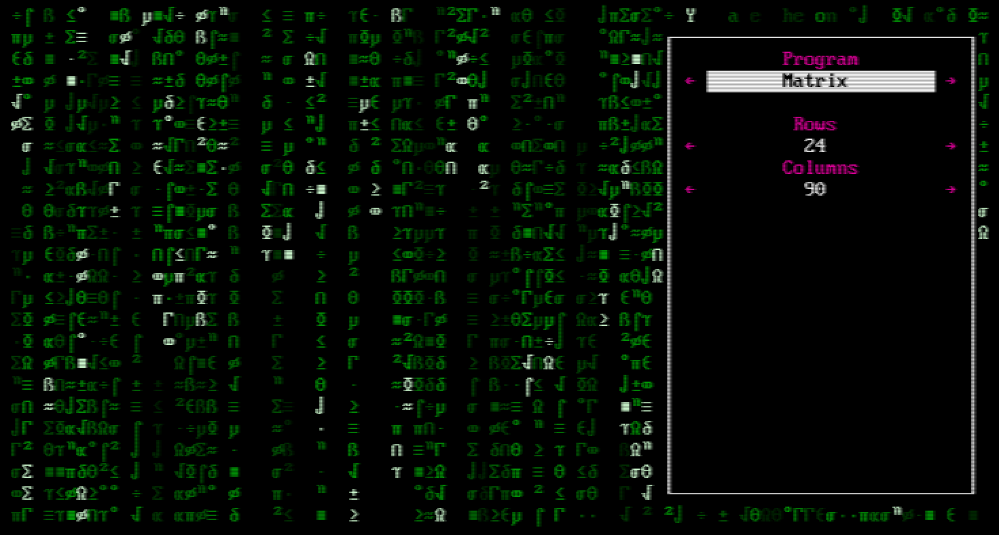
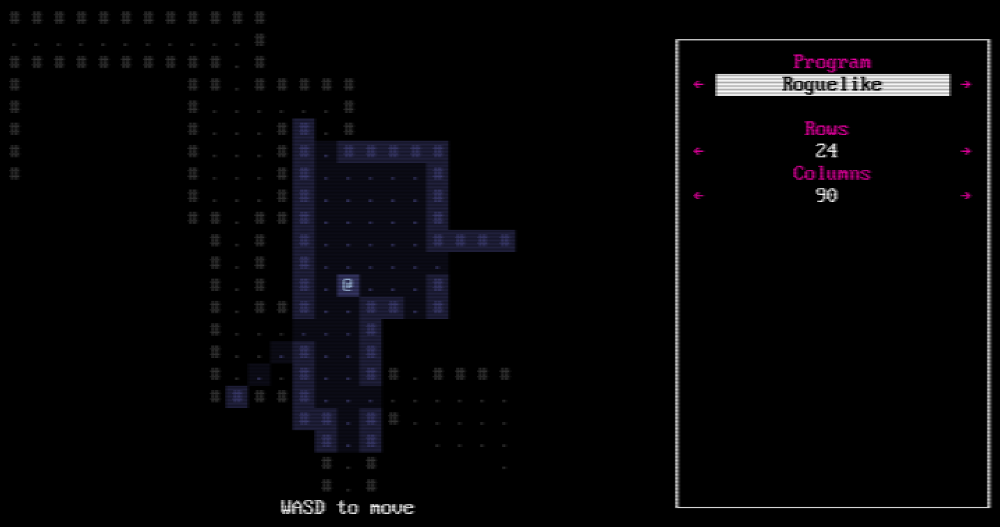
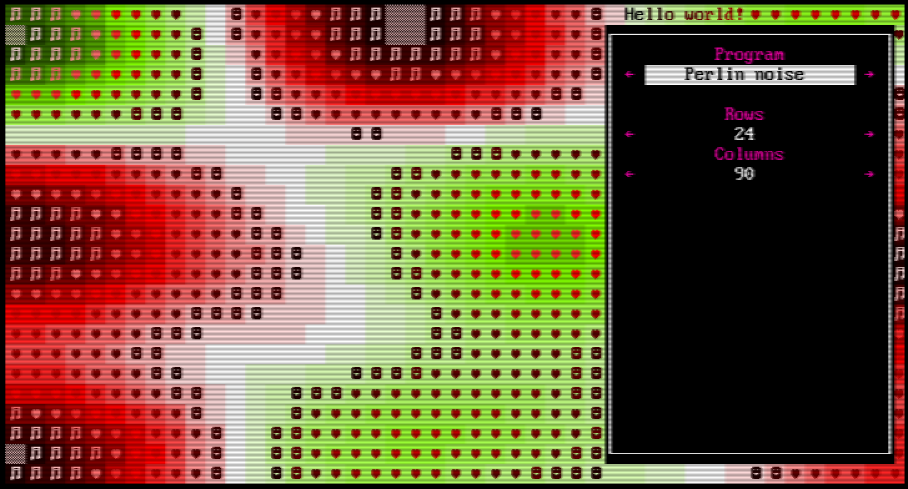

# CavernOS

CavernOS is an experimental minimal runtime for building DOS-era extended ASCII based games and demos that run on the web (via WebAssembly).

## Screenshots





## Features

 - **Distribute to the web** - No need to compile for different operating systems - anyone with a modern web browser can interact with your creation.
 - **Dynamic colouring of glyphs** - All font sprites can be dynamically coloured at runtime. If you create a single tile to represent a creature, this means you can choose its colour at runtime allowing for up to 256 different colour variations of that creature (as well as 256 different background colour variations).
 - **Coexisting full and half-width fonts (or tiles)** - Support for using both half and full width font sprites in the same screen, allowing a square tileset with readable UI - inspired by [Josh Ge's article on fonts in Cogmind](https://www.gridsagegames.com/blog/2014/09/fonts-in-roguelikes/).
 - **Pixel-perfect auto-scaling** - The display area is automatically scaled up in integer increments to preserve the pixel-perfect edges of the font, including on HiDPI screens. At 2x upscaling and larger, there's an added scanline effect to add a bit more retro feel.
 - **Near native performance** - WebAssembly allows near native performance in the browser, by allowing browsers to compile WebAssembly instructions to native instructions as they parse the code. There's no builtin garbage collection, so you have full control over the module's memory. This means any map generation, complex AI or calculations can happen almost as if it were running natively (albeit single-threaded). Additionally the host uses WebGL for low overhead hardware accelerated rendering, running at a smooth 60 FPS, just in case you need it.
 - **Tiny bundles** - The entire demo build (host + app) shown in the screenshots above is currently around 160KB, with the demo app taking around 70KB of that. You can produce WebAssembly modules as small as a few hundred bytes. In contrast most general game engines bundle a whole lot of stuff in their web builds, typically producing several megabyte builds which is overkill for something like an ASCII based roguelike.
 - **Choose your language** - You can write in [any language that compiles to WebAssembly](https://github.com/appcypher/awesome-wasm-langs). However, [Rust](https://www.rust-lang.org/) seems to have the best support for WebAssembly as a target currently, the demo application is built with Rust and this README is written mostly with Rust in mind.

## Limitations

CavernOS has a few limitations, but you could see these as helping with creativity and reducing scope, making this an ideal tool for game jams. However, since you're working in your own codebase and simply interfacing with the host you can always break out of the host and build your own rendering/input engine if you later find these too limiting.

 - Maximum 508 total sprites (254 each half and full width font sprites)
 - 256 colour palette
 - Maximum of 65,536 total characters on screen, at 256x256 characters.
 - No system calls. WebAssembly is sandboxed and the host communicates only via a raw block of memory, no native system call equivalents are exposed to the WebAssembly module. Note that if you're working with C, this includes `malloc`! However you can [write your own malloc](https://surma.dev/things/c-to-webassembly/) to allocate memory within the WebAssembly module's memory block.

## Not yet implemented

These are features that aren't currently implemented, but could potentially be added. For now this is just an experimental project for me, so I'm not sure how much time I'll invest at this stage, but if these are things you think you'd use, please open an issue and let me know.

 - **Audio support**
 - **Terminal host** - There's nothing about WebAssembly that limits it to being run on the web. With tools like [Wasmer](https://wasmer.io/), theoretically a native host could be built that runs the exact same `.wasm` module, but in a native application - and could even render to a terminal for access via SSH etc. Compile your game once, run it everywhere.
 - **Persistence** - There's currently no way to persist any savegames, so at this stage it's probably not very useful for anything longer than coffee break games.

## Getting started

### 1. Install prerequesites

You'll need to have installed:
 - `node` and `npm` to build the host
 - `rust` to build the demo application
 - A simple web server to run the build locally

### 2. Build the host and demo application

After cloning this repo, run the following shell script in the root directory:

```
./build-example-rs.sh
```

All the files needed to run the demo will now be inside the `/dist` folder. To run these locally, you'll need to host the files with a http server as browsers will refuse to load WebAssembly otherwise. Make sure your http server serves the `.wasm` file with the correct mime type. I recommend [Host These Things Please](https://github.com/thecoshman/http) as it does the right thing, and it's easy to install if you're using Rust.

With **Host These Things Please** installed:

```
cd dist && http
```

### 3. Building your own app

Take a look at the `build-example-rs.sh` script to see what files are needed for your app. If you're building something with Rust, you can use the `example-rs` folder as an example to work from. If you're working with C/C++/another language, you'll need to write your own code to read and write to the shared host memory. See [/docs/api](/docs/api) for details.

#### manifest.json

This file contains specifies configuration for your application.

 - **manifestVersion** - Set to 1
 - **program** - The WebAssembly module to load that contains your compiled application
 - **fonts.gridSize** - This should be an object specifying the size (in pixels) of a single character in the `narrow` (half-width) font.
 - **fonts.narrow** - This is the filename of the half-width font, which must be 16x16 characters in size. Eg, if your gridSize is 8x16, this file should be 128x256 pixels.
 - **fonts.square** - This is the filename of the full-width font, which must be 16x16 characters in size. Eg, if your gridSize is 8x16, this file should be 256x256 pixels.
 - **palette** - This is the filename of the 16x16 pixel palette image. Palette colours are indexed from left to right, top to bottom.
 - **inputMappings** - This is an array of all keypresses that you want your application to receive:
    - **address** - The memory address in the input block that will be set/unset by these keys
    - **comment** - An optional comment describing the key
    - **keys** - A list of keys that will trigger this memory address. See [MDN for a listing of valid values](https://developer.cdn.mozilla.net/en-US/docs/Web/API/KeyboardEvent/key/Key_Values)

### 4. Distributing

Upload the files in the `/dist` folder to a static file server, and you're good to go. Distributing via itch.io should just be a matter of zipping up everything in that folder and uploading via their web interface.
